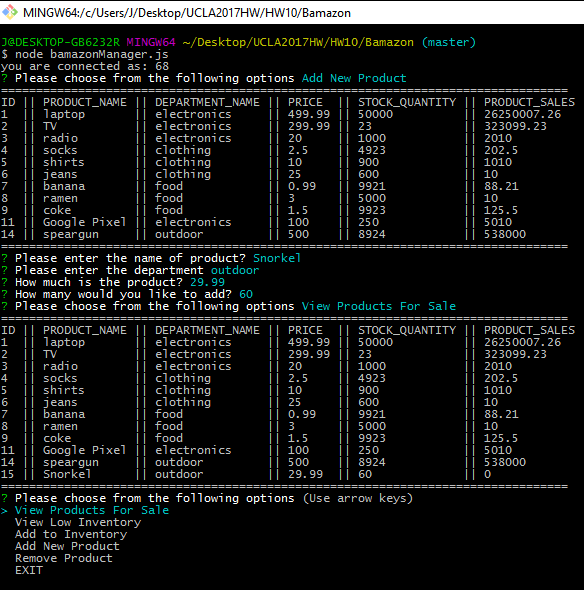

# Bamazon
#### Bamazon is an Amazon-like storefront with the MySQL. This CLI App is written in Node.js & MySQL. 

--------------------------------------------------------------------

## Installation
--------------------------------------------------------------------

1. package.json includes all the required modules.
2. bamazonCustomer.js, bamazonManager.js, and bamazonSupervisor.js will run on node.js

--------------------------------------------------------------------

## bamazonCustomer.js
--------------------------------------------------------------------

1. Running bamazonCustomer.js file will first display all of the items available for sale.

2. Customer can pick the item they would like to buy.

3. The second message ask user how many units of the product they would like to buy.

4. If the customer placed the order that are larger qty than the store's stock qty.

--------------------------------------------------------------------

## bamazonManager.js
--------------------------------------------------------------------

1. Running this application will list a set of menu options.

2. If a manager selects View Products for Sale, the application should list every available item: the item IDs, names, prices, and quantities.

3. If a manager selects View Low Inventory, then it should list all items with a inventory count lower than 100.

4.If a manager selects Add to Inventory, your application should display a promop that will let the manager "add more" of any item currently in the store.

5.If a manager selects Add New Product, it should allow manager to add a completely new product to the store.

6.If a manager slects Remove Product, it will allow manager to select the item and then it will be removed from the server.

--------------------------------------------------------------------

## bamazonSupervisor.js
--------------------------------------------------------------------

1. If a Supervisor selects View Product Sales by Department, the application will display a summarized table in bash window.

2. If a Supervisor selects Create New Department, the application will create a new department based on inputs.

